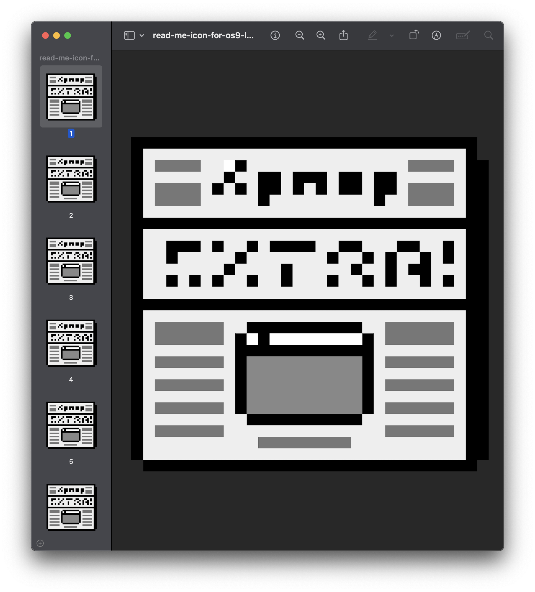

# Perfect-Revival-of-the-ReadMe.icns-MacOS9
Recreated pixel-for-pixel — no compromises, just nostalgia.

***

All standard icon sizes included, beautifully packed into a single .icns:

- 16×16
- 16×16@2x (32×32)
- 32×32
- 32×32@2x (64×64)
- 64×64
- 64×64@2x (128×128)
- 128×128
- 128×128@2x (256×256)
- 256×256
- 256×256@2x (512×512)
- 512×512
- 512×512@2x (1024×1024)

***



Apply a custom .icns icon via terminal

```zsh
brew install fileicon
fileicon set /path/to/your.app /path/to/icon.icns
killall Finder  # Optional: refresh Finder to see the new icon
```

😃

